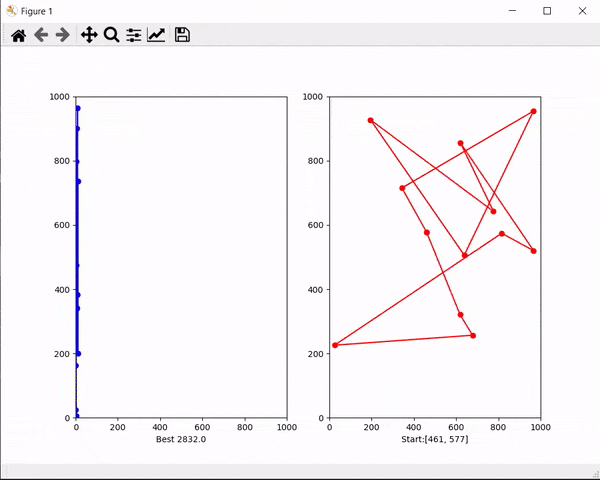
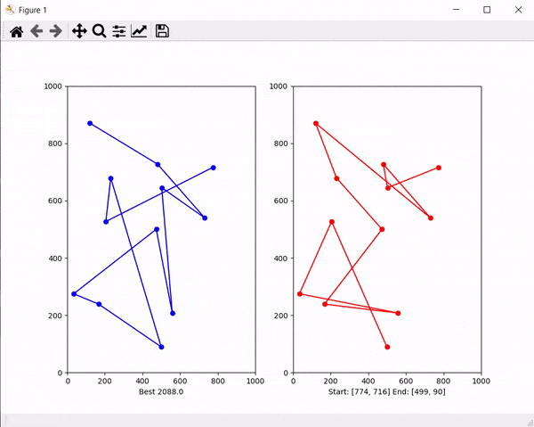

# Genetic Algorithm : Travelling Salesman Problem
Genetic algorithms are heuristic search algorithms inspired by the process that supports the evolution of life. The algorithm is designed to replicate the natural selection process to carry generation, i.e. survival of the fittest of beings. Standard genetic algorithms are divided into five phases which are:

- Creating initial population.
- Calculating fitness.
- Selecting the best genes.
- Crossing over.
- Mutating to introduce variations.

These algorithms can be implemented to find a solution to the optimization problems of various types. One such problem is the **Traveling Salesman Problem**. The problem says that a salesman is given a set of cities, he has to find the shortest route to as to visit each city exactly once and return to the starting city.

## Output
- TSP_STS (Start to Start) : 
    -   Travelling salesman starts from Start city 
    -    Visits each city exactly once
    -    Comes back to Start city 

- TSP_STE (Start to End) : 
    -   Algorithm chooses the best Start and End city so as to minimize distance travelled.
    -    Visits each city exactly once
    -    Stays at End City

## Reference:
[The Coding Train](https://thecodingtrain.com/CodingChallenges/035.1-tsp.html)
